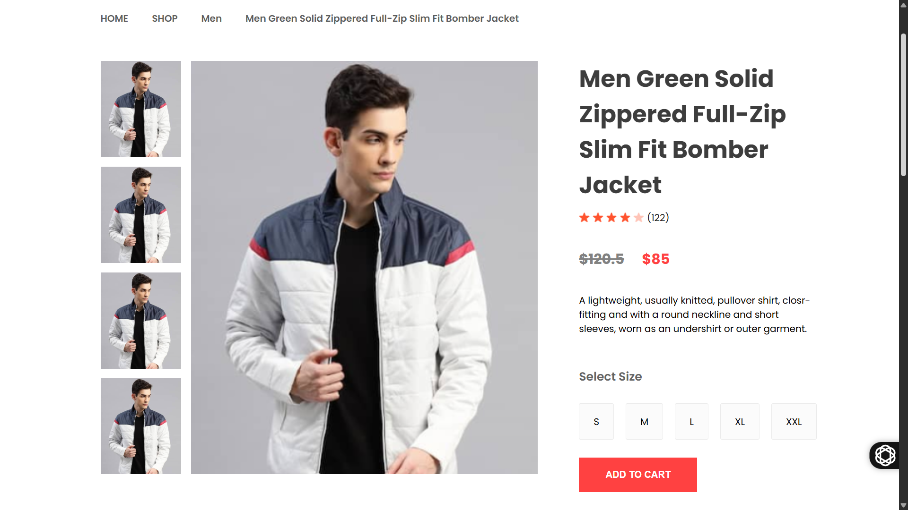
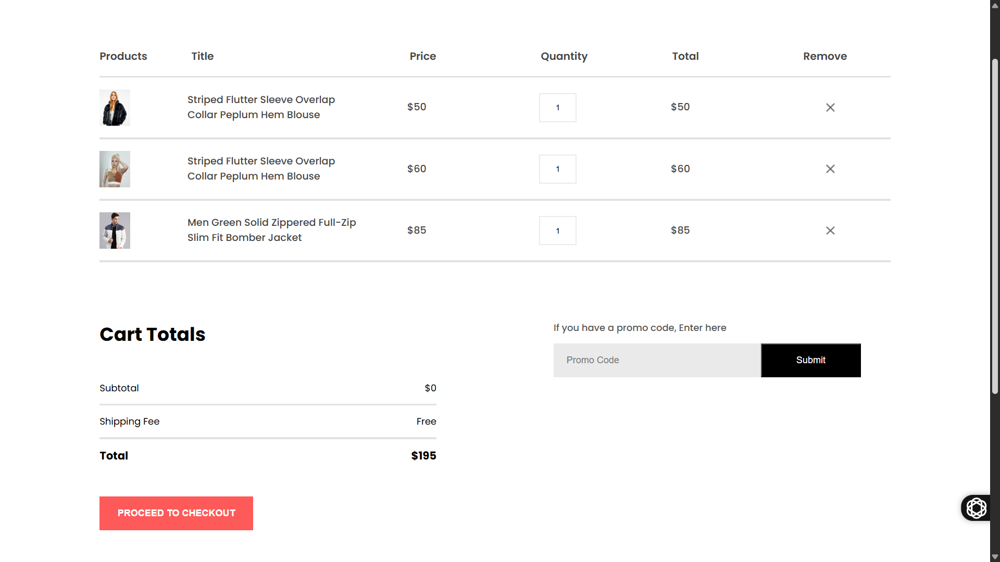

<div id="top"></div>

<div align="center">

# E-COMMERCE-WEBSITE
*Transform Shopping Into Seamless, Exciting Experiences*


*Built with the tools and technologies:*


</div>

---

## 📸 Screenshots

| Home Page | Product Display | Cart Page |
| :--: | :--: | :--: |
|  |  |  |

---

## 📑 Table of Contents

- [Overview](#overview)
- [Getting Started](#getting-started)
  - [Prerequisites](#prerequisites)
  - [Installation](#installation)
  - [Usage](#usage)

---

## 🧐 Overview

**E-Commerce-Website** is a feature-rich ReactJS project providing a solid foundation for building scalable online stores with a focus on user experience and maintainability.  
It leverages React's component architecture and context API to deliver seamless shopping workflows.

**Why E-Commerce-Website?**

This project simplifies building dynamic e-commerce platforms. Core features include:

- 🧩 **Modular Components:** Reusable product displays, cart items, and navigation.
- 🚀 **State Management with Context:** Centralized handling of cart and product data.
- 🛍️ **User-Centric Navigation:** Category browsing, detailed product pages, breadcrumbs, and routing.
- 🎯 **Marketing & Engagement:** Hero banners, offers, related products, and newsletters.
- 🔒 **User Authentication:** Secure sign-up and login flows.

---

## 🚀 Getting Started

### ✅ Prerequisites

- **Programming Language:** JavaScript
- **Package Manager:** npm

---

### ⚙️ Installation

Build the project from source and install dependencies:

```
# Clone the repository
git clone https://github.com/Surya821/E-Commerce-Website

# Navigate to the project directory
cd E-Commerce-Website

# Install dependencies
npm install
```

---

## ▶️ Usage
Run the project locally with:
```
npm start
```

---